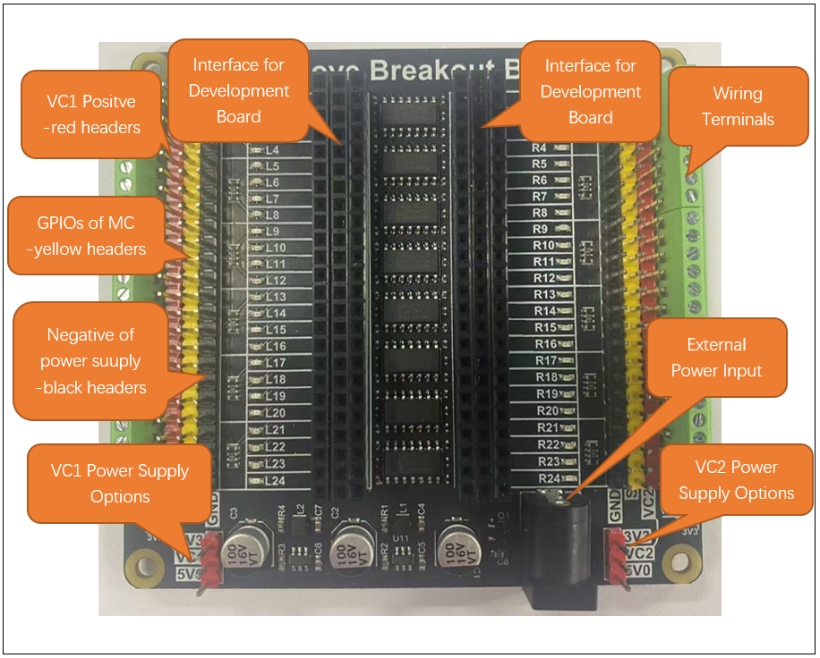
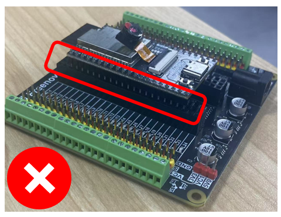
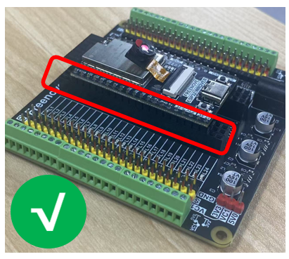
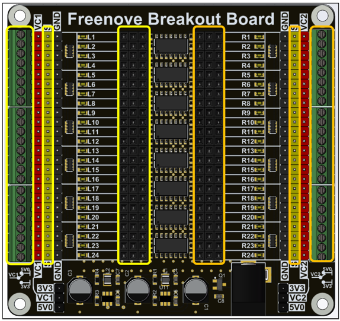
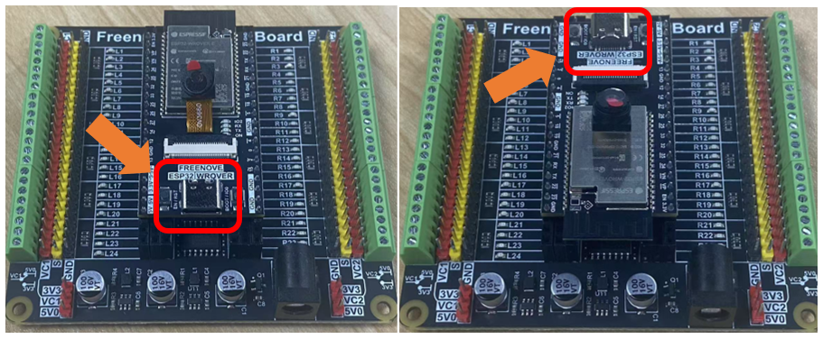
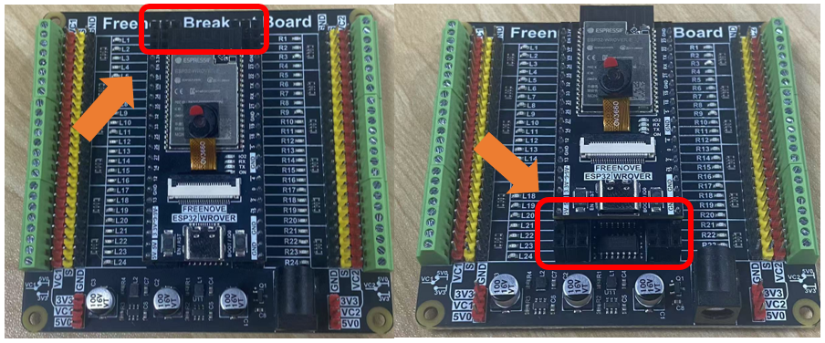
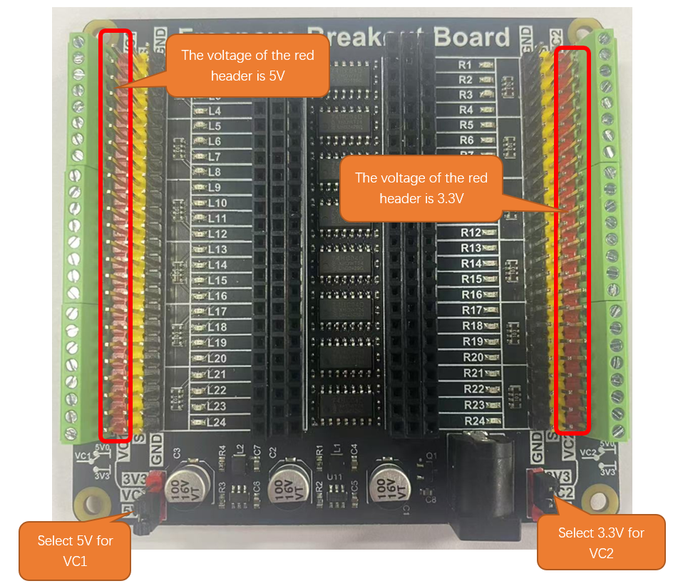

##############################################################################
Chapter 1 Freenove Breakout Board
##############################################################################

Introduction to Freenove Breakout Board

The hardware interfaces are distributed as follows: 

Usage Notes:

1. The Freenove Breakout Board is compatible with various development boards, but the width of the development board should be between 600mil and 1000mil. If the development board does not meet the installation requirements, do not force it into place to avoid damaging the Freenove Breakout Board.

2. The Freenove Breakout Board includes two voltage regulator circuits. One circuit steps down the external input power to 5V at 3A, while the other steps it down to 3.3V at 3A. The external power input voltage range is 5-12V. We recommend using a power supply device with 12V at 3A to power the Freenove Breakout Board.

3. Please note that the red pins on the Freenove Breakout Board represent the positive power supply (VCC), and the black pins represent the negative power supply (GND). When connecting external circuits, do not short-circuit the red and black pins, as this may damage the Freenove Breakout Board or your development board.

4. Connect VC1 to the red pins on the left side of the Freenove Breakout Board, and VC2 to the red pins on the right side. VC1 and VC2 can be freely chosen to be either 5V or 3.3V.

If you have any problems or difficulties using this product, please contact us for quick and free technical support: support@freenove.com

Installation of Freenove Breakout Board
************************************************

Our Breakout Board is designed for great convenience and can accommodate a wide range of development boards. Regardless of the type of development board, the installation process remains consistent. For illustration purposes, we will use the Freenove ESP32 Wrover Board as an example.

When installing the development board, ensure that the pin headers and sockets are securely aligned. Failure to do so may result in poor contact, potentially affecting the device's normal operation.

.. table::
    :align: center

    +----------------+----------------+
    | |Chapter01_01| | |Chapter01_02| |
    +----------------+----------------+

1. When installing the development board, please be patient. Forceful disassembly or installation may cause the board's pins to be bent or even damaged.

2. The wiring terminals, S pins, and sockets on the Freenove Breakout Board are interconnected, as shown in the figure below: 

3. The Freenove Breakout Board does not restrict the installation direction of the development board, allowing you to choose different orientations for installation.

4. The Freenove Breakout Board does not restrict the installation position of the development board, enabling you to select an appropriate location for installation, as shown in the figure below:

:red:`If you need any support, please feel free to contact us via:` support@freenove.com

Freenove Breakout Board Power Choice
***********************************************

The Freenove Breakout Board allows you to select the appropriate power supply using jumper caps. As shown in the figure below, we use a jumper cap to connect VC1 to 5V0 and another jumper cap to connect VC2 to 3.3V.

