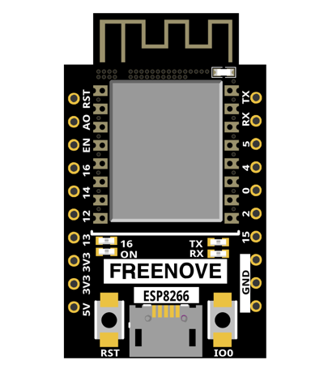
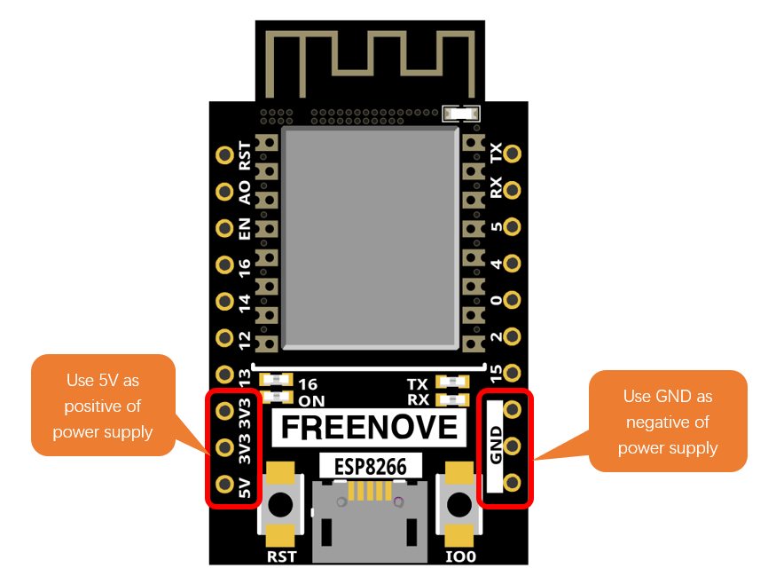
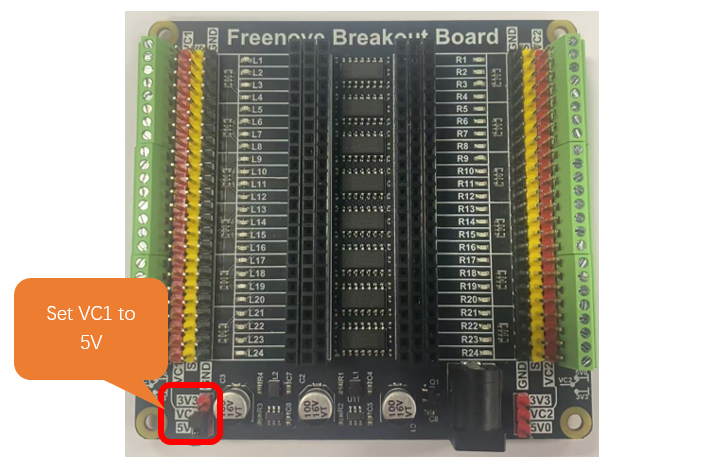
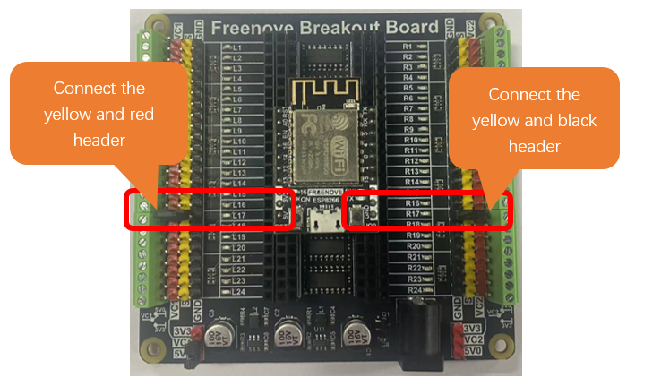
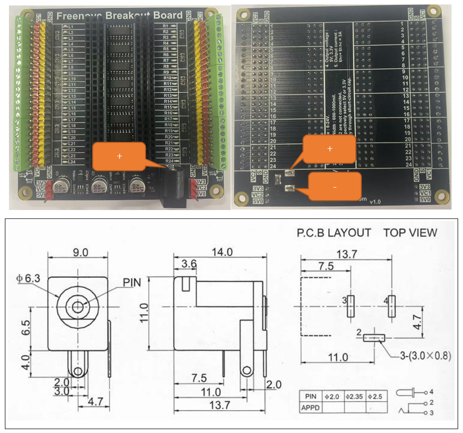
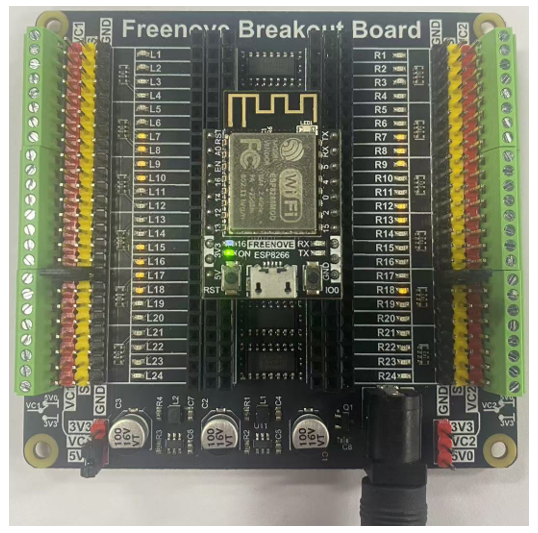
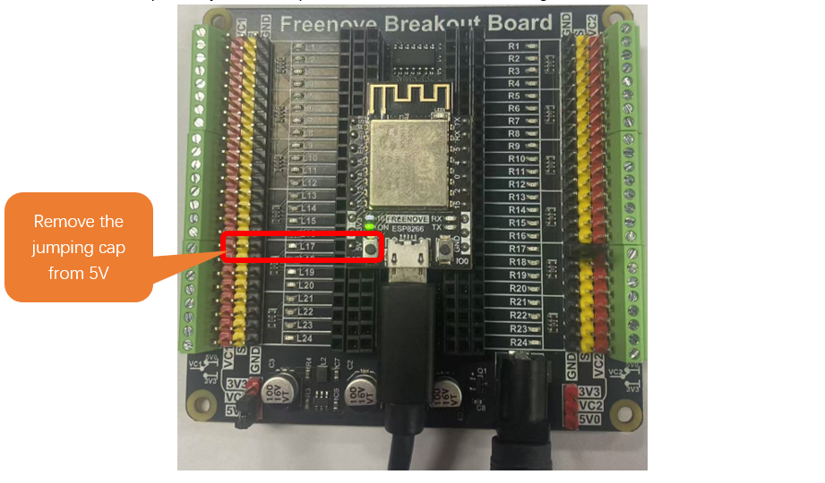

##############################################################################
Chapter 3 ESP8266
##############################################################################

The Freenove Breakout Board is compatible with a variety of development boards. However, the width of the development board should be between 600mil and 1000mil. If the development board does not meet the installation requirements, do not force the installation, as this may cause damage to the Freenove Breakout Board.

This section will use the ESP8266 as an example.

Resources for ESP8266
******************************************

Download link for Freenove ESP8266

https://freenove.com/fnk0073/

Or you can visit our github to download: 

https://github.com/Freenove/Freenove_Ultimate_Starter_Kit_for_ESP8266

Regarding the programming instructions for the Freenove ESP8266, we won't delve into them here. 

If you're interested, please refer to the following resources:

For For C Programming Tutorial, you can check 

**Freenove_Ultimate_Starter_Kit_for_ESP8266\\C\\C_Tutorial.pdf**

For Python Programming Tutorial, you can refer to 

**Freenove_Ultimate_Starter_Kit_for_ESP8266\\Python\\Python_Tutorial.pdf**

For Processing Programming Tutorial, you can refer to

**Freenove_Ultimate_Starter_Kit_for_ESP8266\\Processing\\Processing_Tutorial.pdf**

Installing ESP8266
**********************************

Step1: Select the Power Input and GND Pins for the Microcontroller

Regardless of the type of development board, it typically features external power input pins, which are commonly situated near the data line connection area on the board. It is important to note that when both VIN/VCC/5V and 3.3V power options are present on the development board, it is advisable to prioritize the use of VIN/VCC/5V for powering the board. 

Taking the Freenove ESP8266 Board as an example, this board is marked with both 5V and 3.3V silk screen labels. This indicates the presence of a voltage regulator circuit on the board that steps down the 5V input to a 3.3V output. Generally, the 3.3V is intended for use as an output power supply, while the 5V serves as the input power supply. Consequently, when powering the board, the 5V pin should be used as the positive terminal of the input power supply, and the GND pin should be used as the negative terminal. This is illustrated in the figure below.

Step2: Power the Development Board
==========================================

In the first step, the Freenove ESP32 WROVER Board utilizes 5V for the positive power supply terminal and GND for the negative power supply terminal. Consequently, it is necessary to set VC1 to 5V.

As illustrated below:

Conect the yellow header aligned with the 5V pin of the microcontroller to the red header on the left of the breakout board.

Connect the yellow header aligned with the GND pin of the microcontroller to the black header on the right of the breakout board.

:red:`Please note: The red header pin represents the positive power terminal, and the black header pin represents the negative power terminal. During use, under no circumstances should the red and black header pins be short-circuited, as doing so will damage the Freenove Breakout Board.`

Step3: Power Supply Precautions
===========================================

Freenove Breakout Board DC005 Jack

The interface for external power supply to Freenove Breakout board is a DC005 interface, whose size is 5.5x2.1mm. Please pay attention to its positive and negative terminals, as shown in the figures below.

:red:`The Freenove Breakout Board features a reverse power protection circuit. This design ensures that the board is safeguarded from damage in the event of an improperly connected external power supply. If, after connecting the external power, the Freenove Breakout Board fails to power the development board, it is likely due to a polarity mismatch in the DC interface being used. The positive and negative terminals may be reversed. It is crucial to verify the specifications of the DC interface to confirm that it is correctly aligned with the board's requirements.`

If the external power supply is connected correctly, the power indicator on the development board will light up. 

**Usage Recommendations:**

1. During experiments, if the development board is connected to USB for power supply or code downloading, and the Freenove Breakout Board is powered by an external power source, we recommend that you disconnect the positive connection between the development board and the Freenove Breakout Board. This can better protect your development board. As shown in the figure below.

2.	If you are powering the development board using only a data cable, be aware that the combined power consumption of the ESP8266 and any external circuits should not be excessive. Generally, a computer's USB port can only supply 5V at 0.5A to 1A. If your total power consumption exceeds the USB port's capacity, it may cause the development board to operate abnormally or even damage your computer's USB port.

3.	If you are using an external power source to power the development board, ensure that the positive and negative terminals of the development board are correctly connected to the Freenove Breakout Board.

4.	Each pin on the Freenove Breakout Board is equipped with an indicator LED, which is used to indicate the voltage level state of the development board's pins. If you control a pin to output high or low voltage levels, the indicator LED will change accordingly. Similarly, if some pins on your development board are not in use, they will be in a floating state, which could be either high or low voltage. The corresponding indicator LED on the board will light up or turn off accordingly. If you do not want the indicator LED to light up or turn off, you can control it to output a high or low voltage level through programming.

:red:`If you need any support, please feel free to contact us via:` support@freenove.com